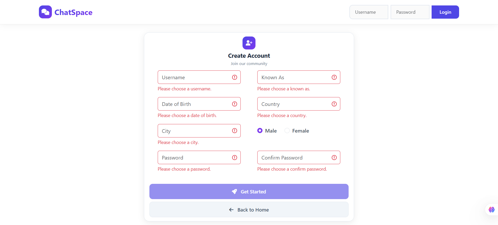
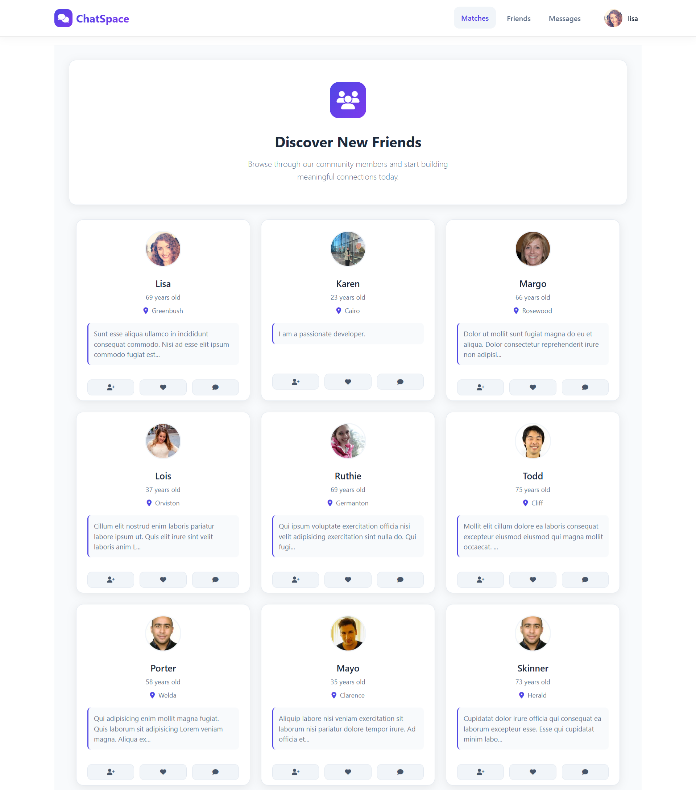
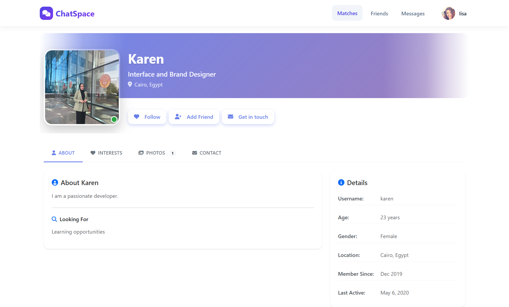
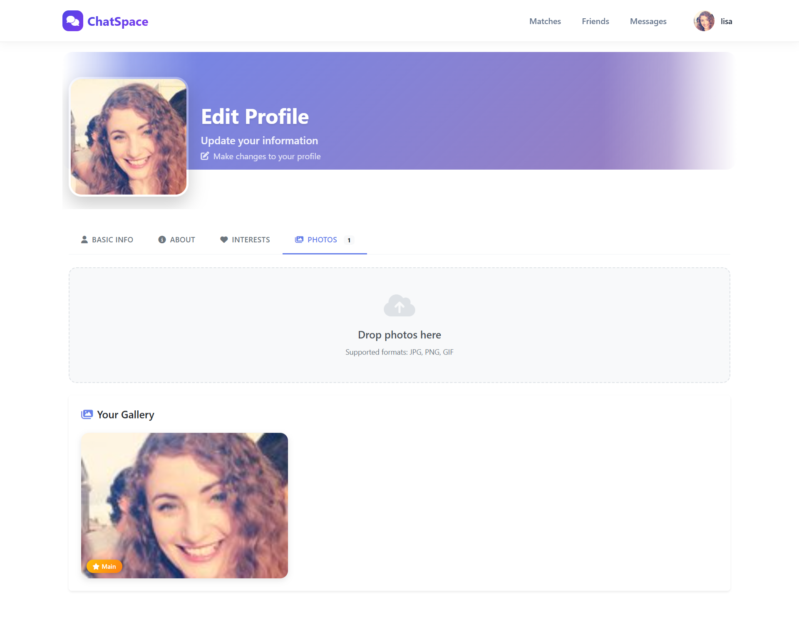
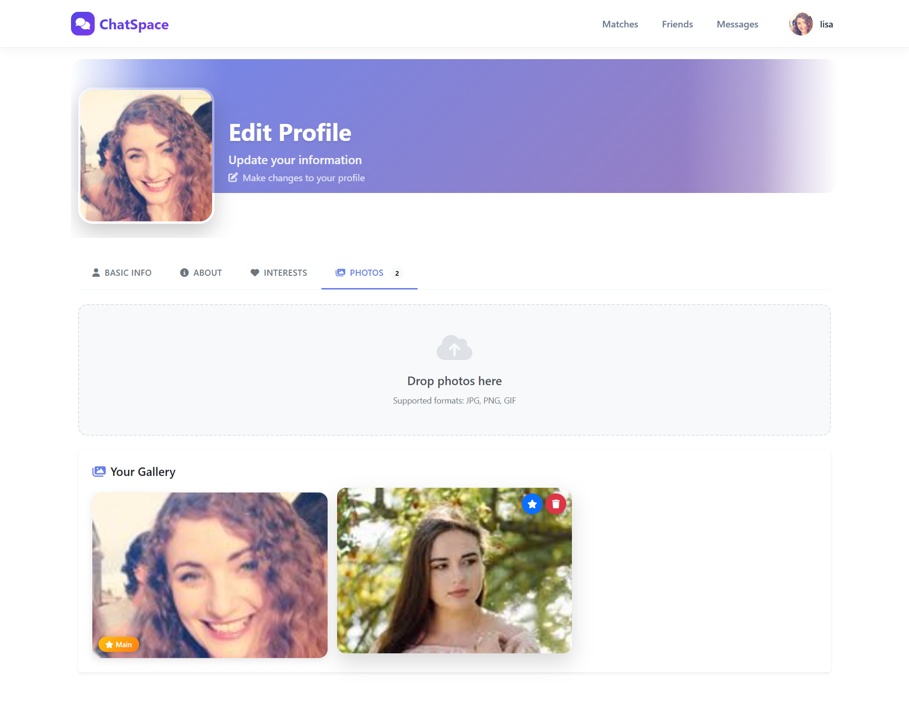

## Features

- **User Authentication**
  - User registration with form validations
  - Secure login and logout

- **User Profile Management**
  - Edit profile information
  - Upload and change profile images
  - Set a main profile image
  - Delete profile images

- **Explore People**
  - Discover and search for other users
  - View public user profiles

- **Chat System**
  - One-to-one real-time chat
  - Send and receive messages

- **Friends & Following**
  - Add and remove friends
  - Follow and unfollow users

- **User Interactions**
  - Like user content or profiles (if applicable)

- **Form Validation**
  - Client-side validation using Angular Reactive Forms
  - Clear and user-friendly error messages
## 📸 Application Screenshots

### Login Page

### Register Page

### Members Page

### Member Details Page

### Edit Photo Page

